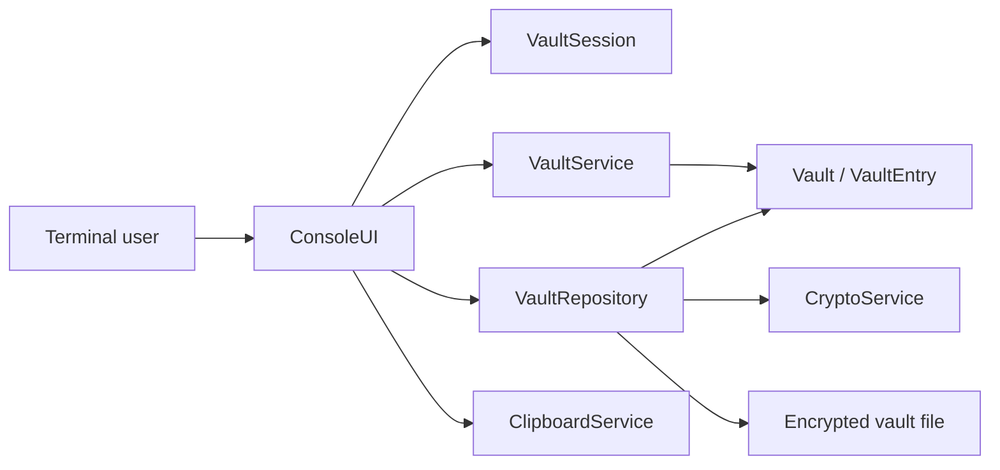
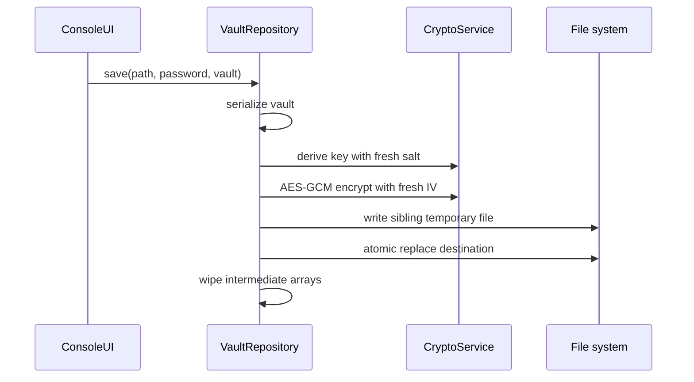

# Architecture

## System Overview

The UI coordinates workflows but does not implement encryption or persistence.
`VaultService` owns validation and credential operations. `VaultRepository`
serializes the complete model and delegates cryptographic operations to
`CryptoService`. `VaultSession` owns the short-lived in-memory master-password
copy and inactivity locking.

## Persistence Transaction

If serialization, encryption, or the temporary write fails, the previous vault
is not replaced.

## Design Decisions

### Authenticated encryption

AES-GCM was selected so modification and incorrect-password failures are
detected before plaintext is accepted. Encryption without authentication would
not provide an acceptable vault format.

### One encrypted payload

All entry fields are serialized and encrypted together. This avoids leaking
service names, usernames, notes, entry counts, or timestamps as plaintext
metadata.

### Local file instead of a database

A single file keeps the project portable and makes crash-safe replacement and
backup behavior explicit. The tradeoff is that the complete vault is present in
memory while unlocked.

### Layered, framework-free Java

The project intentionally avoids dependency injection and UI frameworks. The
small constructor-wired layers remain directly testable while keeping the
security-sensitive control flow visible during review.

